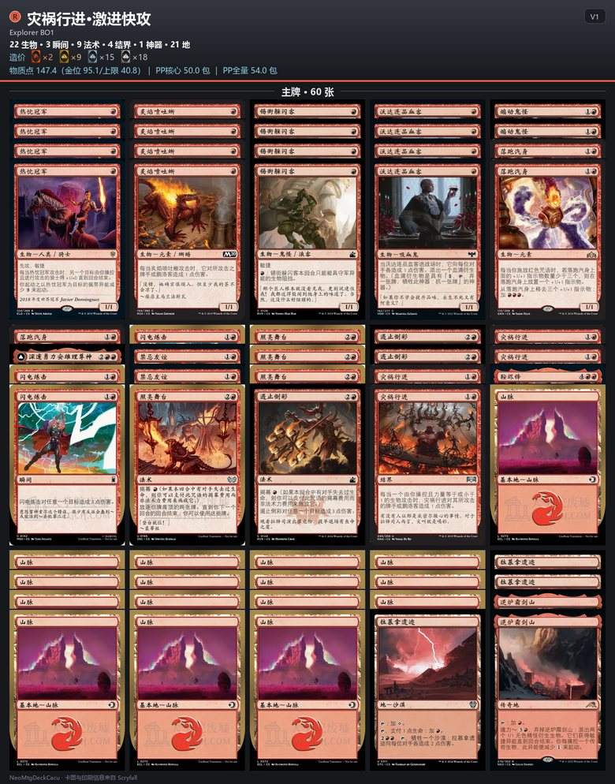

# NeoMtgDeckCacu

万智牌（MTG）套牌研究、构筑与测试工具箱。Python 3.7+，以标准库为主，围绕 MTGA 的
构筑/限制两条竞技主线沉淀工具链与方法论：从环境调研、候选枚举、构筑验证到图文交付，
全流程有对应脚本与文档规范。


## 开发方向

**两条主线**

1. **构筑套牌工作流**——环境基线（Scryfall/MTGCH 检索、合法性、禁牌表）→ 候选枚举 →
   构筑（`deck_pooper.py`）→ 验证（`mtg_tool.py validate`）→ 版本化交付
   （`deck_version.py` + `deck_image.py` 牌表图 + 造价块）。
   特化方向：**标准新手系列**——同一流程在"低造价新手预算"场景的特化，附带造价核算
   （`tools/newbie/deck_cost.py`：造价签名 / 物质点 / PP 包数）与逐套牌金鱼模拟器。
2. **限制赛条线**——售前新系列预览追踪与单卡评分建库（`set_preview_tool.py`）→
   实战轮抓座舱（`mtga_draft_tool.py`：17Lands 锚点、LLM 抓牌建议、评分回归）。

**工具组（支撑）**：MTGA 日志分析/战绩回收/实时建议（`mtga_log_tool.py`、
`mtga_auto_tool.py`、`mtga_db_tool.py`）；Forge 离线对局模拟（`forge_tool.py`，增强内容）。

**交叉能力**：LLM 集成（DeepSeek，轮抓/对局建议）；MTGA 客户端资源提取与图像化交付；
外部参考研究（`Ref/`）。

## 交付物示例：牌表图

`deck_image.py` 把 MTGA 导入格式牌表渲染成 Untapped.gg 风格网格图：叠卡切片、类别分组、
中文类型统计，造价行直接使用 MTGA 客户端原生野卡图标（M 红橙 / R 金 / U 冰银蓝 / C 银白），
后附物质点与 PP 包数明细（指标口径见 `MtgDeckCostMetric.md`）。



## 图标资源

`tools/assets/icons/` 为从本机 MTGA 客户端提取的项目资源：`wildcard/`（野卡卡背四稀有度）、
`mana/`（法术力符号 46 个：五色 + C/S/X/T + 数字 0–20 + 混色）、`type/`（类型图标，
客户端原生仅 Artifact / Enchantment / Land）。客户端大更新后用
`tools/extract_mtga_icons.py` 重提（需本机 MTGA + 可选依赖 UnityPy）。

## 快速开始

```bash
# 回归测试（282 例）
python -m unittest discover -s tools -p "test_*.py"

# 牌表门禁 / 单卡合法性核查
python tools/mtg_tool.py validate deck.txt --format pioneer --bo3
python tools/mtg_tool.py check "Card Name" --format pioneer --platform arena

# 造价签名（签名 + 物质点 + PP 包数）
python tools/newbie/deck_cost.py sig deck.txt

# 牌表图（同名 PNG 落入牌表目录）
python tools/deck_image.py deck.txt --title "标题" --format "Explorer BO1" --subtitle "V1"

# Forge 模拟 / MTGA 日志扫描 / 轮抓座舱
python tools/forge_tool.py sim deck-a.txt deck-b.txt --games 20
python tools/mtga_log_tool.py scan
python tools/deck_pooper.py draft --watch --set HOB --llm --port 8643
```

## 文档导航

| 文档 | 内容 |
|---|---|
| `AGENTS.md` | 仓库规范：结构、命令、风格、测试与提交约定 |
| `tools/README.md` | 工具手册：每个脚本的口径与用法 |
| `MtgDeckCacuWorkFlow.md` | 构筑工作流（阶段 0–5 全流程规范） |
| `MtgSetReviewWorkFlow.md` / `MtgSetReviewTemplate.md` | 新系列评测工作流与模板 |
| `MtgDeckCostMetric.md` | 造价指标定义的唯一权威来源（签名/物质点/PP、MRUC 视觉方案） |
| `DeckPooperDesign.md` | deck_pooper 设计文档 |

## 数据与版权

本地产出（`DeckList/`、`MatchRecord/`、`AuditReport/`、`SimResult/`、`SetReview/`、
`tools/cache/`、`tools/data/` 等）一律 gitignored 不入库。卡图与图标素材版权归
Wizards of the Coast 所有，仅限本项目研究用途；本项目为非营利粉丝工具，与 WotC 无关联。
